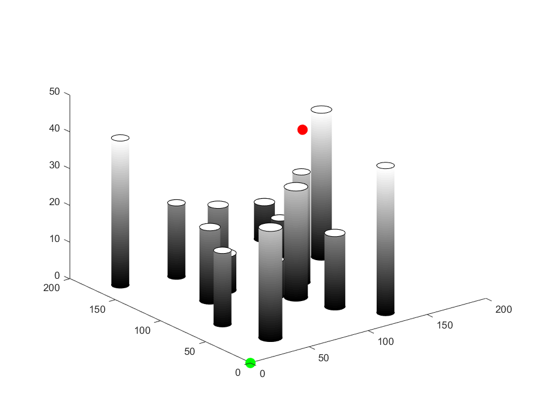

# RRT* implementation for drone path planning in 3D

# Introduction
RRT*, namely the Rapidly-Exploring Random Trees algorithm, is a method which can gernerate an optimal path to reach any point within certain steps in theory. The process can be summarized in the following steps:
  1. Generate a random vertex
  2. Find the closet vertex from the existing vertex list evaluated by euclidiean distance or other distance metrics, and build up an edge, recording the weight(cost) of edge
  3. Check if the newest edge has collision with obstacles. If so, back to step 2
  4. Search neighboors of this new vertex within a certain radius, and exam the total cost of path from the start point to each neighboor, and from neighboor to the newly added vertex. Select the neightboor which has least cost as the new parent point of this vertex. Rewire the tree
  5. repeat step 2 to 5 until reaching the destination

# Implement details
## Environment build up
In this implemtation, several cylinders will be generated to simulate the obstacles. See the image below, where the green dot denotes the start point, the red dot denotes the end point. 
<!-- 
 -->

## Run RRT* 
The search tree will grow to search the optimal path in generated environment. The density of search space is mannually set. The higher, the slower it searches, but the result would be more optimal. The following image shows the search result, where blue curve is the original curve tree, the yellow curve is the rewired braches and the red curve the final path. The blue start dots are random uniform points for slicing the space.

## Simulate drone flying
After finding the optimal path, the drone will fly along this path from start point to end point, as shown in the following snap.

## Backstep controller simulation(not successful)
A controller is designed to track the flying path, but this part is not fully successful. 

# Execution
run src/RRT3_test.m file

The final simulation result can be viewed here: https://www.youtube.com/watch?v=_tHyY_e-AvQ
